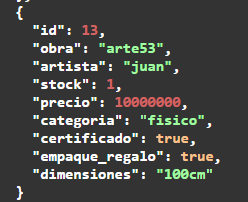
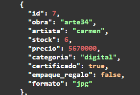

# 🏭 Pruebas del Patrón Abstract Factory

El patrón **Abstract Factory** permite crear **familias de objetos relacionados**
sin depender de sus clases concretas.

En el sistema se utiliza para manejar diferentes familias de productos:

- obras físicas
- obras digitales

---

# 🎯 Objetivo de la prueba

Comprobar que el sistema pueda generar objetos pertenecientes
a diferentes familias manteniendo una estructura coherente.

El patrón garantiza que cada familia de productos tenga
**atributos específicos y consistentes con su tipo**.

---

# 📸 Evidencias

## Primera obra creada

---

## Segunda obra creada

---

# 🔍 Comparación de resultados

Compara la primera obra con la segunda.

- La **primera obra** pertenece a la familia **fisico** y contiene el atributo **dimensiones**.
- La **segunda obra** pertenece a la familia **digital** y contiene el atributo **formato**.

---

# 🧠 Análisis técnico

La **Abstract Factory** se evidencia al observar atributos específicos por familia de producto:

- la familia **fisico** incluye **dimensiones**
- la familia **digital** incluye **formato**

Esto garantiza la **consistencia de los datos y la correcta construcción de cada tipo de objeto** dentro del sistema.

---

# ✔ Resultado esperado

Cada familia de productos mantiene sus propios atributos
sin afectar la estructura de las demás familias.

Esto demuestra que la creación de objetos está correctamente
separada por **familias de productos**, tal como establece
el patrón **Abstract Factory**.
