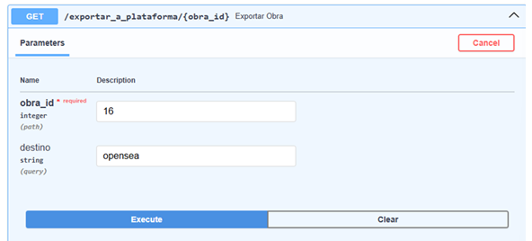
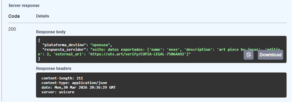

# 🔌 Pruebas del Patrón Adapter

El patrón **Adapter** permite adaptar la estructura de datos del sistema
para que sea compatible con plataformas externas sin modificar el modelo interno.

En este proyecto se utiliza para:

- exportar obras a plataformas externas
- transformar atributos internos a formatos requeridos
- integrar servicios como UTS y OpenSea

---

# 🎯 Objetivo de la prueba

Verificar que el sistema pueda:

- exportar una obra a diferentes plataformas
- transformar los datos correctamente según el destino
- mantener la estructura interna sin modificaciones

---

# 📸 Evidencias

## Exportación a OpenSea

---

## Resultado de exportación

---

# ✔ Resultado esperado

El sistema traduce correctamente los datos de la obra,
adaptando los nombres de los atributos según la plataforma destino,
sin afectar la estructura interna del sistema.
