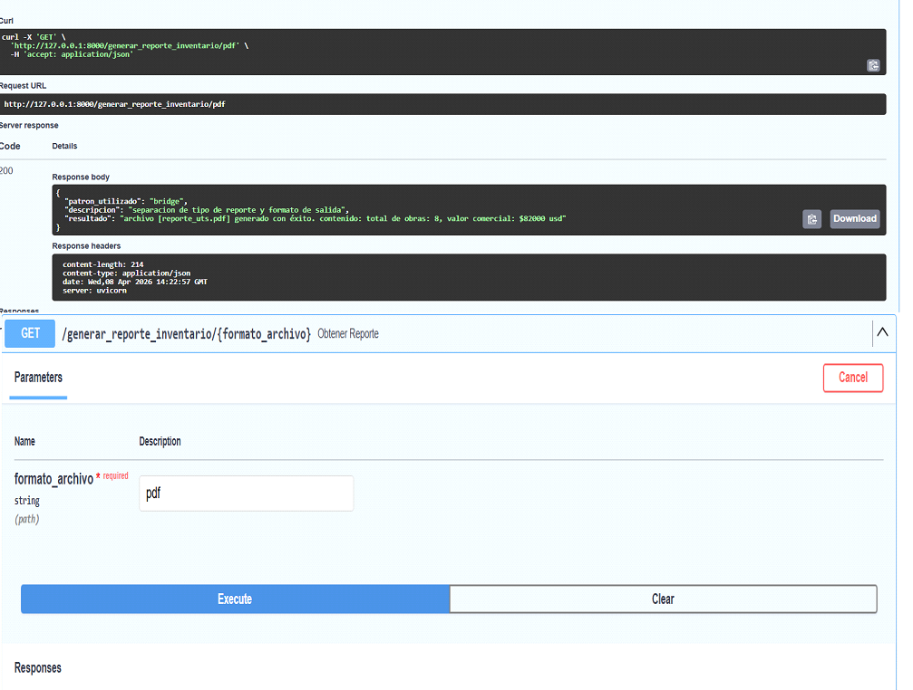
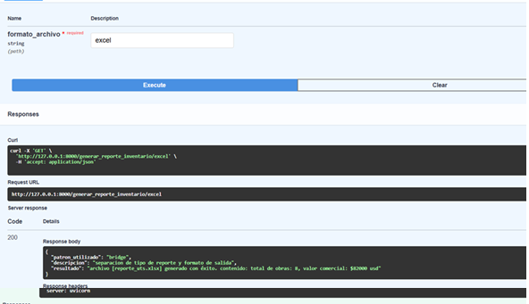

# 🌉 Pruebas del Patrón Bridge

El patrón **Bridge** permite separar la lógica de negocio de la lógica de presentación, permitiendo que ambas evolucionen de forma independiente.

En este proyecto se utiliza para:

- generar reportes del inventario
- exportar información en diferentes formatos (PDF y Excel)
- desacoplar el contenido del reporte de su representación

---

# 🎯 Objetivo de la prueba

Verificar que el sistema pueda:

- generar un reporte del inventario correctamente
- exportar el mismo contenido en diferentes formatos
- mantener la independencia entre los datos y el formato de salida

---

# 📸 Evidencias

## Generación de reporte

  

  

---

# ✔ Resultado esperado

El sistema genera correctamente el reporte del inventario, manteniendo el mismo contenido, pero permitiendo su representación en distintos formatos como PDF o Excel, sin modificar la lógica de negocio.
