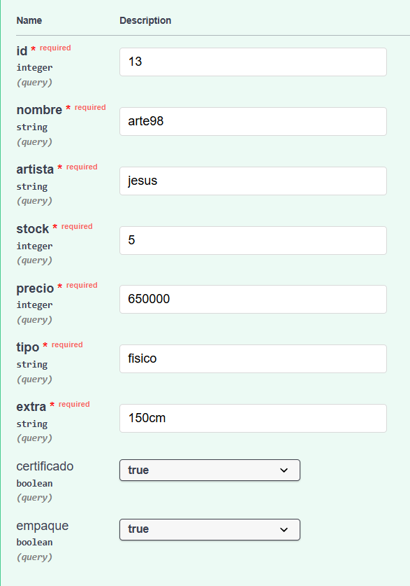
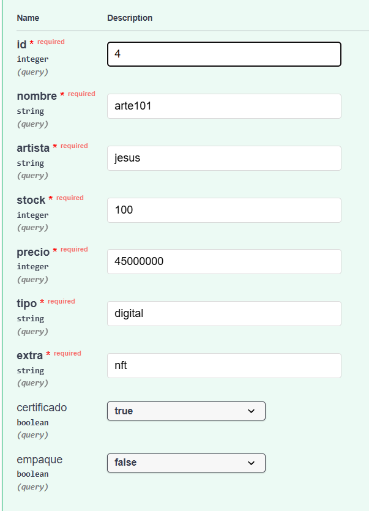
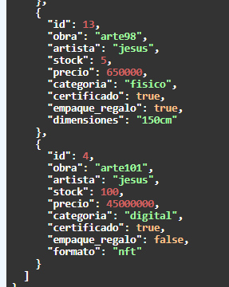

# 🧱 Pruebas del Patrón Builder

El patrón **Builder** permite construir objetos complejos paso a paso,
agregando propiedades adicionales sin modificar el proceso de creación.

En este proyecto se utiliza para configurar características
de las obras creadas.

---

# 🎯 Objetivo de la prueba

Verificar que el sistema pueda:

- agregar propiedades adicionales a una obra
- construir objetos paso a paso
- mantener la flexibilidad en la creación de objetos

---

# 📸 Evidencias

## Configuración de una obra

## Resultado de la configuración

---

# ✔ Resultado esperado

El objeto final contiene todas las propiedades configuradas
durante el proceso de construcción.
