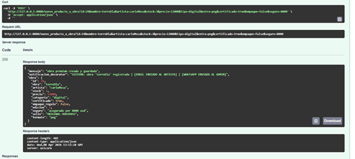
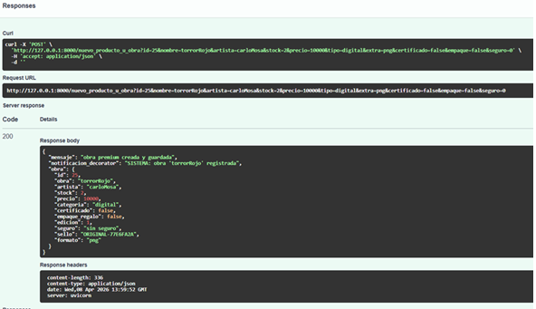

# 🧩 Pruebas del Patrón Decorator

El patrón **Decorator** permite añadir responsabilidades adicionales a un objeto de forma dinámica sin modificar su estructura base.

En este proyecto se utiliza para:

- generar notificaciones dinámicas
- añadir avisos por Email y WhatsApp
- extender el mensaje base según los atributos de la obra

---

# 🎯 Objetivo de la prueba

Verificar que el sistema pueda:

- generar una notificación base
- añadir funcionalidades adicionales dinámicamente
- adaptar el mensaje según las condiciones de la obra

---

# 📸 Evidencias

## Notificación con decoradores

---

## Notificación base

---

# ✔ Resultado esperado

El sistema genera correctamente la notificación base y añade dinámicamente capas adicionales como Email y WhatsApp cuando se cumplen las condiciones, manteniendo la flexibilidad y el desacoplamiento del sistema.
