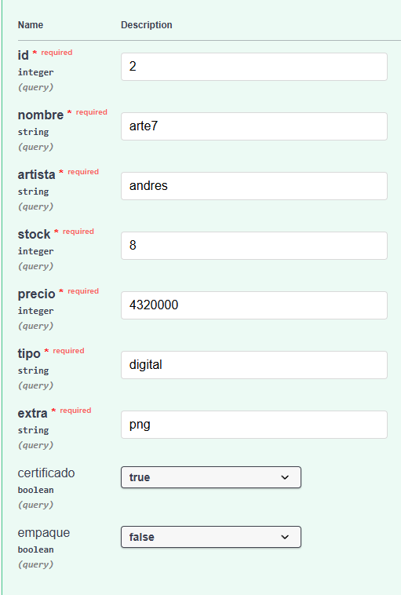
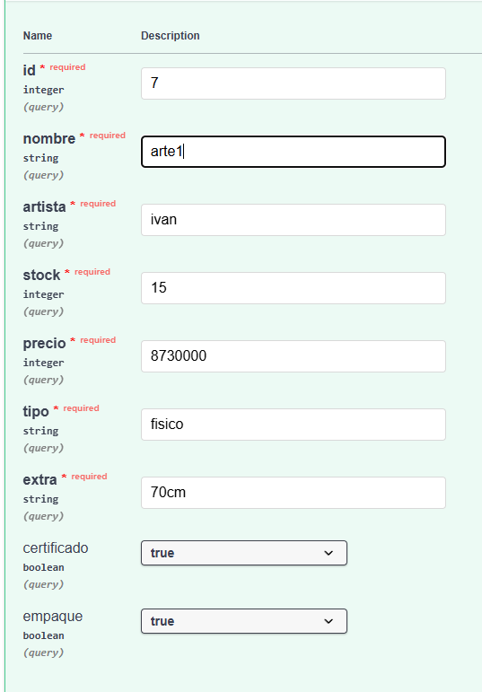
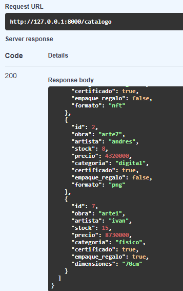

# 🏭 Pruebas del Patrón Factory Method

El patrón **Factory Method** permite crear distintos tipos de objetos sin acoplar
la lógica del sistema a clases específicas.

En este proyecto se utiliza para crear:

- obras físicas
- obras digitales

---

# 🎯 Objetivo de la prueba

Verificar que el sistema pueda:

- crear obras físicas
- crear obras digitales
- seleccionar automáticamente el tipo de objeto correcto

---

# 📸 Evidencias

## Creación de obra digital

---

## Creación de obra física

---

## Resultado de creaciones

---

# ✔ Resultado esperado

La fábrica selecciona correctamente la clase correspondiente
según el tipo de obra solicitado.
