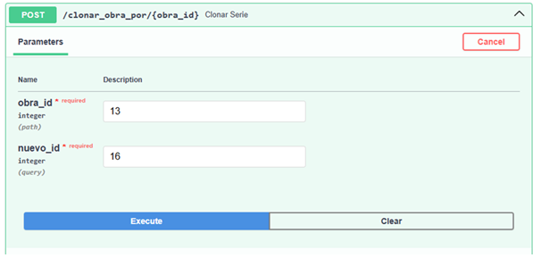
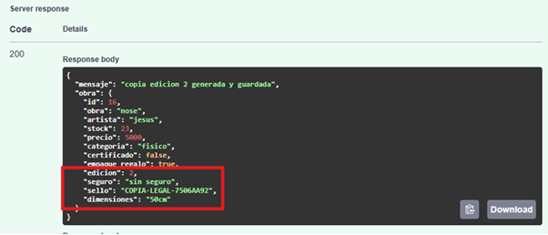
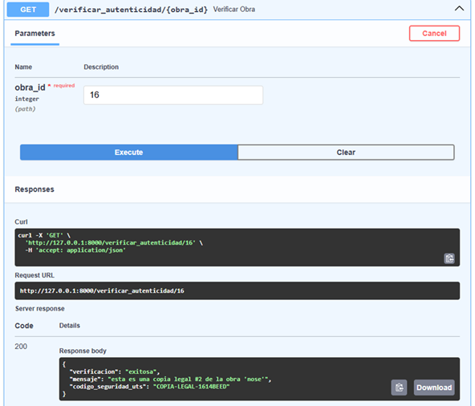

# 🧬 Pruebas del Patrón Prototype

El patrón **Prototype** permite clonar objetos existentes sin crear nuevas instancias desde cero.

En este proyecto se utiliza para:

- clonar obras existentes
- generar colecciones en masa
- verificar autenticidad mediante sellos únicos

---

# 🎯 Objetivo de la prueba

Verificar que el sistema pueda:

- clonar una obra correctamente
- generar múltiples copias con identidad única
- identificar si una obra es original o copia legal

---

# 📸 Evidencias

## Clonación de obra

---

## Generación en masa

---

## Verificación de autenticidad

---

# ✔ Resultado esperado

El sistema clona correctamente las obras, asignando un nuevo ID,
un número de edición y un sello único que permite verificar su autenticidad.
