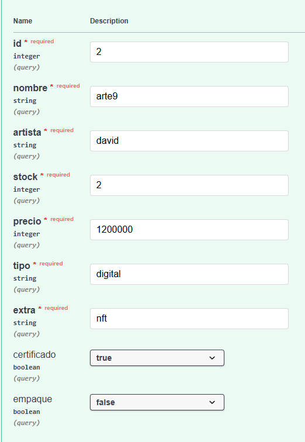
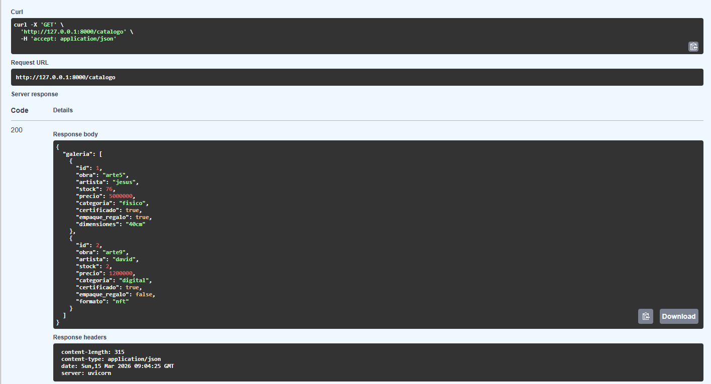

# 🧩 Pruebas del Patrón Singleton

El patrón **Singleton** garantiza que el sistema utilice **una única instancia
del inventario** durante toda la ejecución.

Esto permite que todas las operaciones trabajen sobre el mismo conjunto de datos.

---

# 🎯 Objetivo de la prueba

Verificar que el inventario del sistema:

- se cree una sola vez
- sea compartido por todas las operaciones
- mantenga la lista de obras registrada

---

# 📸 Evidencias

## Creación del inventario

---

## Registro de obras en el inventario

---

# ✔ Resultado esperado

El sistema mantiene **una única instancia del inventario**, permitiendo que todas
las operaciones accedan al mismo almacenamiento de datos.
