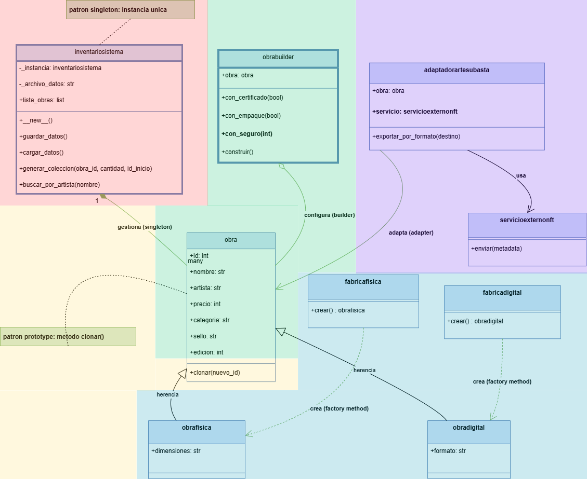

# 📐 Diagramas UML del Sistema

Este directorio contiene los **diagramas UML utilizados para modelar la arquitectura del sistema**.

Los diagramas permiten visualizar la **estructura del software y la relación entre sus componentes**.

---

## 📊 Diagramas incluidos

### 🧩 UML general del sistema (Actualizado)

---

🔴 **Rojo:** Patrón Singleton (gestión centralizada del inventario)  
🔵 **Azul:** Abstract Factory y Factory Method (creación de obras físicas y digitales)  
🟢 **Verde:** Patrón Builder (construcción y validación de objetos)  
🟡 **Amarillo:** Patrón Prototype (clonación y autenticidad de obras)  
🟣 **Morado:** Patrón Adapter (adaptación a plataformas externas)  

---

## 🎯 Propósito

Los diagramas UML permiten:

- comprender la arquitectura del sistema
- identificar los patrones de diseño implementados
- facilitar la explicación técnica y estructural del proyecto
- visualizar la relación entre las clases y componentes

---

📌 Estos diagramas sirven como **guía visual para entender la estructura del código**.
