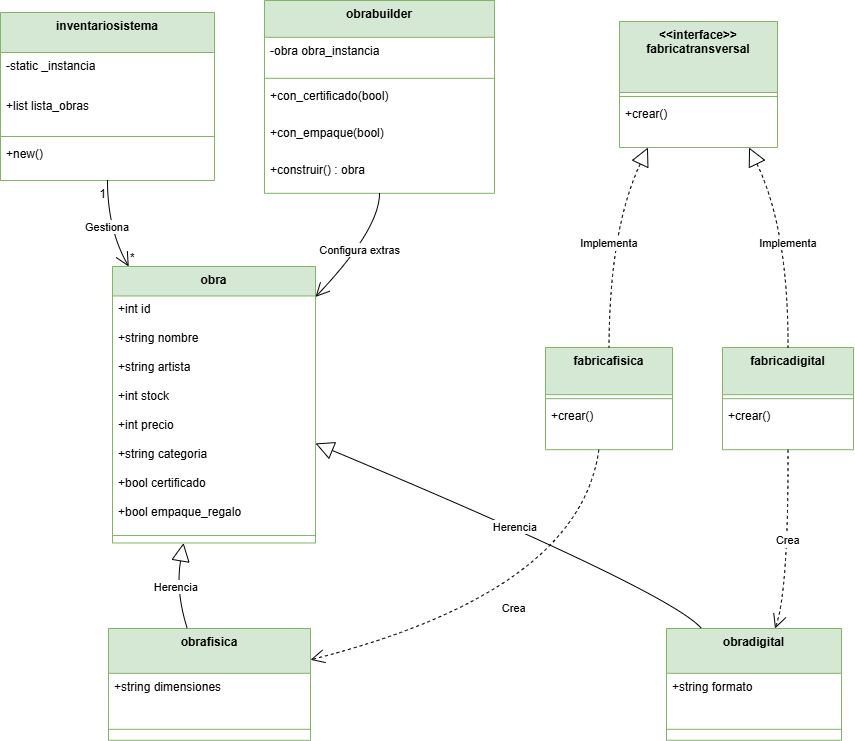
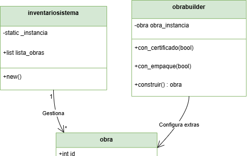
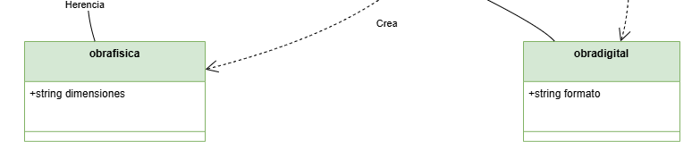
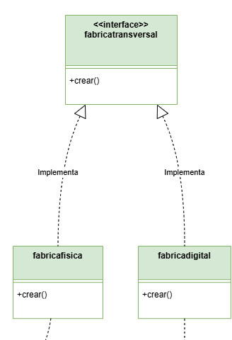
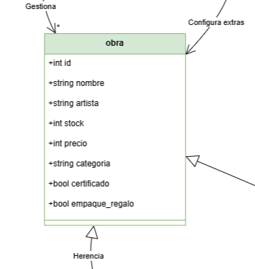

# 📐 Diagramas UML del Sistema

Este directorio contiene los **diagramas UML utilizados para modelar la arquitectura del sistema**.

Los diagramas permiten visualizar la **estructura del software y la relación entre sus componentes**.

---

## 📊 Diagramas incluidos

### 🧩 UML general del sistema

---

### 🧩 Patrón Singleton

---

### 🧩 Patrón Factory Method

---

### 🧩 Patrón Abstract Factory

---

### 🧩 Patrón Builder

---

## 🎯 Propósito

Los diagramas UML permiten:

- comprender la arquitectura del sistema
- identificar los patrones de diseño implementados
- facilitar la explicación técnica del proyecto

---

📌 Estos diagramas sirven como **guía visual para entender la estructura del código**.
